# Classical Concentrated Solar Power Heliostat Field Layout

## Introduction
This repository contains the Concentrating Solar Power, CSP ( or Solar Tower Power, SPT) heliostat field layout data commonly used in concentrated solar power technology research.

There are [**Gemasolar**](#Gemasolar), [**Gemasolar from FluxSPT**](#Gemasolar-from-FluxSPT), virtual heliostat field [**6282**](#6282)  , [**PS10**](#PS10) , [**Crescent Dunes**](#Crescent-Dunes), [**Dunhuang-10MW**](#Dunhuang-10MW), [**MUEEN**](#MUEEN), [**Solar Two**](#SolarTwo), [**NSTTF**](#NSTTF), [**Radial-Staggered**](#Radial-Staggered) and [**Campo**](#Campo) heliostat field layouts.


## Heliostat Field Layouts

|                    Layout Name                    |                               Type                               |
| :-----------------------------------------------: | :--------------------------------------------------------------: |
|              [Gemasolar](#Gemasolar)              |                    Real CSP Heliostat Layout                     |
| [Gemasolar-from-FluxSPT](#Gemasolar-from-FluxSPT) |                    Real CSP Heliostat Layout                     |
|                   [6282](#6282)                   |                     Virtual Heliostat Layout                     |
|                   [PS10](#PS10)                   |                    Real CSP Heliostat Layout                     |
|         [Crescent-Dunes](#Crescent-Dunes)         |                    Real CSP Heliostat Layout                     |
|          [Dunhuang-10MW](#Dunhuang-10MW)          |                    Real CSP Heliostat Layout                     |
|                  [MUEEN](#MUEEN)                  |                    A heliostat layout method                    |
|              [Solar Two](#SolarTwo)               |                    Real CSP Heliostat Layout                     |
|                  [NSTTF](#NSTTF)                  |                    Real CSP Heliostat Layout                     |
|       [RadialStaggered](#Radial-Staggered)        |                    A heliostat layout method                    |
|                  [Campo](#Campo)                  | A heliostat layout method, it is a type of Radial Staggered layout |
|[Biomimetic-Surround](#Biomimetic-Surround)| A heuristic surround heliostat layout method inspired from spiral patterns of the phyllotaxis disc |
|[Biomimetic-PS10-like](#Biomimetic-PS10-like)| A heuristic northern heliostat layout method inspired from spiral patterns of the phyllotaxis disc |


### Gemasolar  

Gemasolar is located in Andalucía, Spain, began in 2008, putted into operation in 2011.

The heliostats layout as follows:

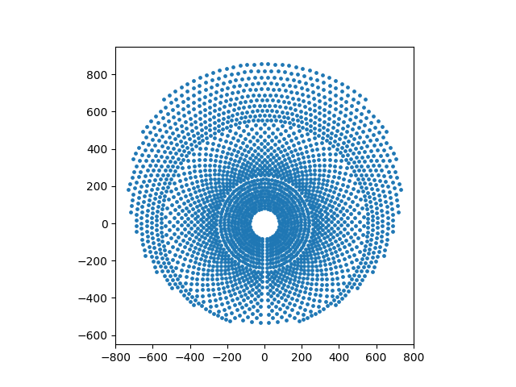


The layout of heliostat field references [[1]](#reference)，every position of heliostat is exported from Google Map.

Other parameters of Gemasolar  reference [[2]](#reference) and [[3]](#reference).  


### Gemasolar-from-FluxSPT

The previous Gemasolar field layout data is extracted by [LiuZengqiang](https://github.com/LiuZengqiang) basing Google Map, and there are another Gemasolar field layout data in flux simulation software [FluxSPT](https://ise.uc3m.es/research/solar-energy/fluxspt/) [[4]](#reference).

Only layout data file without parameter file under the folder ``./Gemasolar_Flux_SPT``, the parameter of Gemasolar can be found in ``./Gemasolar/parameters.xlsx``.

The Gemasolar layout from Flux_SPT is very similar to the data extracted by [LiuZengqiang](https://github.com/LiuZengqiang). It looks like follows:

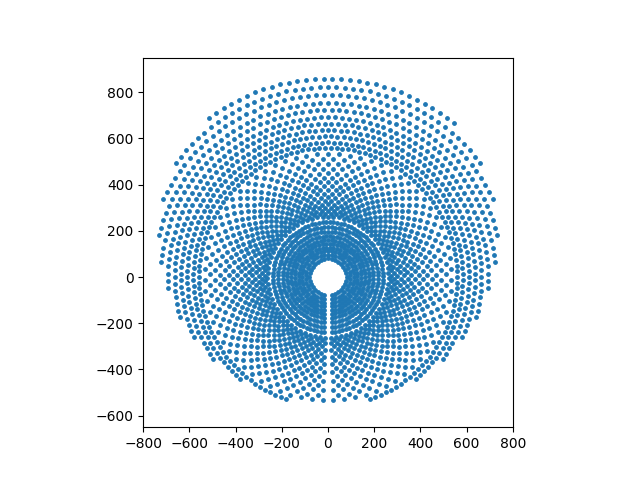


### 6282

6282 is a virtual heliostat field layout in [Soltrace](https://www.nrel.gov/csp/soltrace.html) [[5]](#reference).

The heliostats layout as follows:

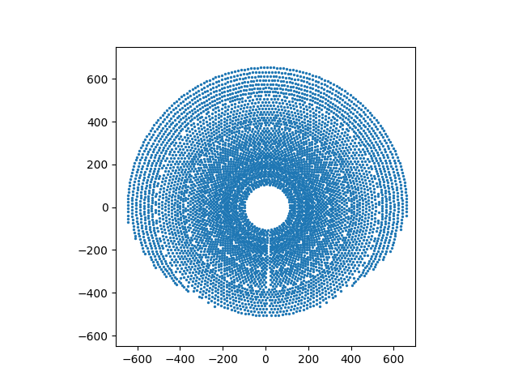

The layout of heliostat field is exported from the  example input file of Soltrace``test2.stinput(6282.stinput)``.

Other parameters is also exported in the example input file ``test2.stinput(6282.stinput)``.

By the way, the ``/6282/6282.stinput`` can be opened using the software [Soltrace](https://www.nrel.gov/csp/soltrace.html).


### PS10

PS10 is located in Sevilla, Spain, constructed began in 2005, operation begin in 2007.

The heliostats layout as follows:

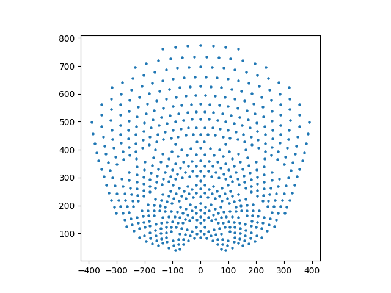

One difference from the previous two solar field is that, the receiver type of PS10 is **cavity receiver** instead of cylinder receiver. The shape of cavity receiver look like as follow [[6]](#reference):

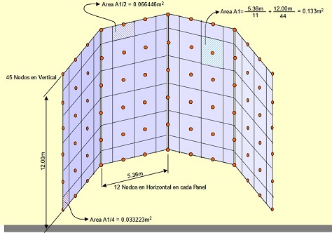

Planform of the cavity receiver as follows:

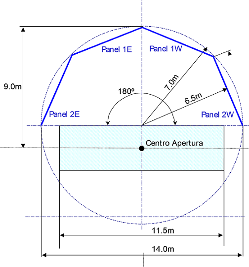

Some parameters data about PS10 can be found in [[7]](#reference), [[8]](#reference) and [[9]](#reference).


### Crescent-Dunes

The Crescent Dunes Solar Energy Project is a solar thermal power project located near Tonopah. The layout of Crescent Dunes is extracted from software FluxSPT. In reality, it contains 10347 heiostats, but only 10301 heliostats's position data in FluxSPT (without the data of outermost heliostats).  

The heliostats layout as follows:

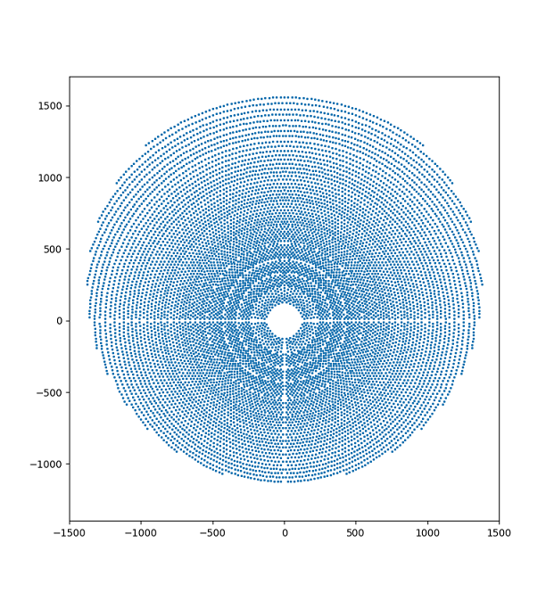


### Dunhuang-10MW

Dunhuang-10MW plant is located in Dunhuang, Gansu Province, China. It has connected to the grid in 2016. The plant is configured with 1525 heliostat. The layout data is also extracted in FluxSPT. Regrettably, there is no parameters of the plant.

The layout of it look likes as follows:

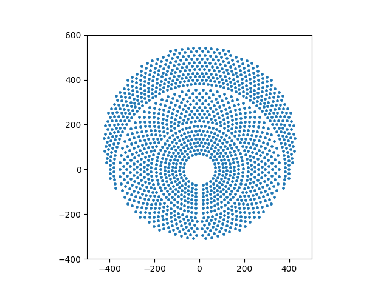

### MUEEN  
Mathematical formulation of a graphical method for a no-blocking heliostat field layout (MUEEN) is a graphical method for a no-blocking radial staggered heliostat layout proposed by Siala in [[10]](#reference). 

``MUEEN.py`` is a python implementation of MUEEN from matlab code [Solstice-Software (mueen_fun.m)](https://www.labex-solstice.fr/solstice-software/#tower) [[11]](#reference).  

The input of MUEEN method is:
```
lm: heliostat length, m
wm: heliostat width, m
z0: height of the heliostat center from the base, m
fa: ratio of the reflecting surface to the total surface of a heliostat
dS: ratio of heliostat separation distance to heliostat length
lr: receiver height, m
Ht: aim point height, m
Dt: tower diameter, m
BL: terrain slope rising away from the tower, radian
PSImax: maximum angular direction, radians (in 1 and 2 quadrant, total angle is 2.0*PSImax), radian
Rmax: maximum ring radius in the field, m
Rmin: minimum ring radius in the field, m
```

and the output is coordinates of each heliostat.  
An example MUEEN layout look likes as follows:  

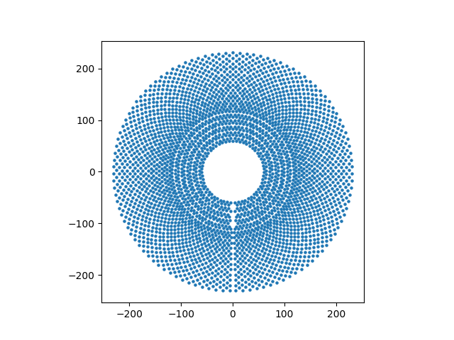

### SolarTwo  
Solar Two was a collaborative, cost-shared project between 11 U.S. industry and utility partners and the U.S. Department of Energy to validate molten-salt power tower technology. The Solar Two plant, located east of Barstow, CA, comprised 1926 heliostats, a receiver, a thermal storage system, a steam generation system, and steam-turbine power block [[12]](#reference).  

The layout of it look likes as follows:  
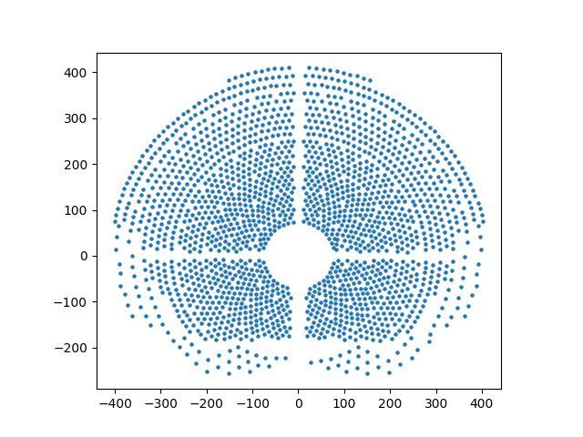


### NSTTF  
National Solar Thermal Test Facility (NSTTF) is a test facility of CSP in the United States. The heliostats layout is refenreced from open source tool [Tracer (Tracer/examples/sandia_hstat_coordinates.csv)](https://github.com/yewang726/Tracer/) [[13]](#reference).  

The layout of it look likes as follows:  
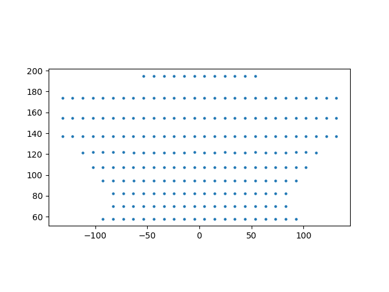


### Radial-Staggered  
Common radial staggered heliostat layout, the heliostats layout create python script ``RadialStaggered.py`` is referenced from open source tool [Tracer (Tracer/tracer/models/heliostat_field.py)](https://github.com/yewang726/Tracer/) [[13]](#reference).

An example Radial-Staggered layout look likes as follows:  
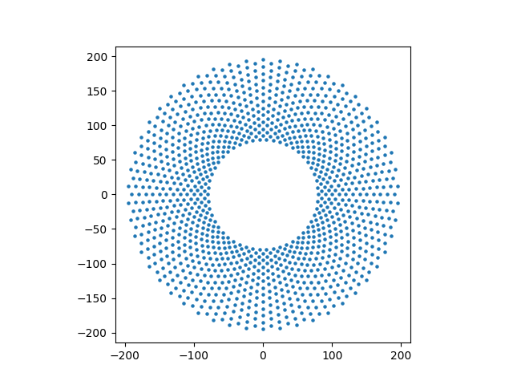

### Campo   
Campo is a algorithm for the design and performance analysis of heliostat fields, it is able to generate refular but flexible redial staggered layouts of heliostat fields. A major feature of campo is the ability to perform fast and accurate calculations of the shadowing and blocking factor for each and every one of the heliostats in the field. Using the Campo layout pattern, the heliostat field layout optimization would proceed from the densest fields, with the worst shadowing and blocking factor, towards expanded fields [[14]](#reference).  
Campo layout create python script ``Campo.py`` is referenced from open source tool [solstice-scripts (solstice-scripts/solsticepy/cal_layout.py)](https://github.com/anustg/solstice-scripts/) [[15]](#reference).

An example Campo layout look likes as follows:
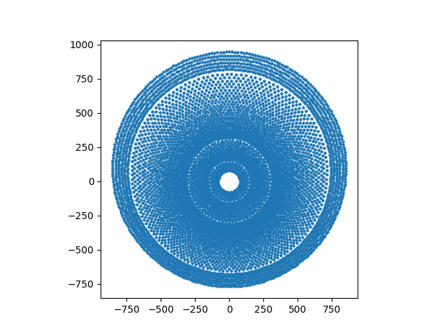

### Biomimetic-Surround
Biomimetic-Surround is a new heuristic algorithm for generating surround heliostat layout. The polar coordinate of each heliostat $(r_{k}, \theta_{k})$ can be calculated by following equation:
$$
r_{k} = a * k^{b}  \\
\theta_{k} = 2 * pi * \phi^{2} * k
$$

where the $k$ is the id of heliostat (start from 1), phi is the golden ratio, equals to $(1+\sqrt{5})/2$, $a$ and $b$ is the coefficient that control the density of the result field, $a$ is 4.5 and $b$ is 0.65 by default.

The biomimetic layout has the advantage of a continuous heliostat density which is similar to the efficiency of heliostats [[16]](#reference).

The Biomimetic surround layout can be created by the python script ``Biomimetic_Surround.py``.

An example Biomimetic-Surround layout look likes as follows:
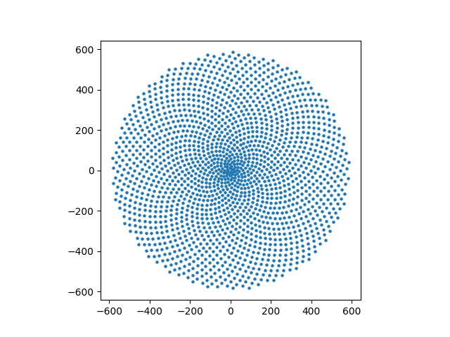


### Biomimetic-PS10-like
Biomimetic-PS10-like is a heuristic algorithm for generating northern heliostat layout, which is constrained by the PS10 field (base field). 
The polar coordinates are calculated in the same way as Biomimetic-Surround, and the result coordinate must be within the convex hull of the PS10 field.

The Biomimetic-PS10-like layout can be created by the python script ``Biomimetic_PS10-like.py``.

An example Biomimetic-PS10-like layout look likes as follows:
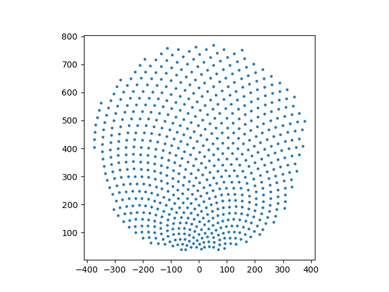

## Reference

[1]. Sánchez-González A, Rodríguez-Sánchez M R, Santana D. Aiming strategy model based on allowable flux densities for molten salt central receivers[J]. Solar Energy, 2017, 157: 1130-1144.

[2]. Schöttl P, Moreno K O, Bern G, et al. Novel sky discretization method for optical annual assessment of solar tower plants[J]. Solar Energy, 2016, 138: 36-46.

[3]. García J, Too Y C S, Padilla R V, et al. Dynamic performance of an aiming control methodology for solar central receivers due to cloud disturbances[J]. Renewable Energy, 2018, 121: 355-367.

[4]. Sánchez-González A, Rodríguez-Sánchez M R, Santana D. FluxSPT: Tool for heliostat field aiming and flux mapping in solar power tower plants[C]//AIP Conference Proceedings. AIP Publishing LLC, 2022, 2445(1): 120020.

[5]. Wendelin T. SolTRACE: a new optical modeling tool for concentrating solar optics[C]//International solar energy conference. 2003, 36762: 253-260.

[6]. Fernández D V. PS10: a 11.0-MWe Solar Tower Power Plant with Saturated Steam Receiver[J]. Solucar.[En línea]:< www. upcomillas. es, 2004.

[7]. Osuna R, Olavarría R, Morillo R, et al. PS10, Construction of a 11MW solar thermal tower plant in Seville, Spain[C]//Proc. 13th IEA SolarPACES Symp. 2006: A4-S3.

[8]. Schöttl P, Bern G, Pretel J A F, et al. Optimization of Solar Tower molten salt cavity receivers for maximum yield based on annual performance assessment[J]. Solar Energy, 2020, 199: 278-294.

[9]. Belaid A, Filali A, Hassani S, et al. Heliostat field optimization and comparisons between biomimetic spiral and radial-staggered layouts for different heliostat shapes[J]. Solar Energy, 2022, 238: 162-177.

[10]. Siala F M F, Elayeb M E. Mathematical formulation of a graphical method for a no-blocking heliostat field layout[J]. Renewable energy, 2001, 23(1): 77-92.

[11]. Le Labex Solstice. (n.d.). Le Labex Solstice. https://www.labex-solstice.fr/solstice-software/#tower

[12]. Bradshaw R W, DAWSON D B, DE LA ROSA W, et al. Final test and evaluation results from the solar two project[R]. Sandia National Lab.(SNL-NM), Albuquerque, NM (United States); Sandia National Lab.(SNL-CA), Livermore, CA (United States), 2002.

[13]. yewang726 (2018). Tracer. GitHub. https://github.com/yewang726/Tracer/. Accessed 22 January 2024.

[14]. Collado F J, Guallar J. Campo: Generation of regular heliostat fields[J]. Renewable energy, 2012, 46: 49-59.  

[15]. anustg (2020). solstice-scripts. Github. https://github.com/anustg/solstice-scripts. Accessed 23 January 2024.

[16]. Noone, C.J., Torrilhon, M., Mitsos, A., 2012. Heliostat field optimization: A new computationally efficient model and biomimetic layout. Solar Energy 86, 792–803. https://doi.org/10.1016/j.solener.2011.12.007